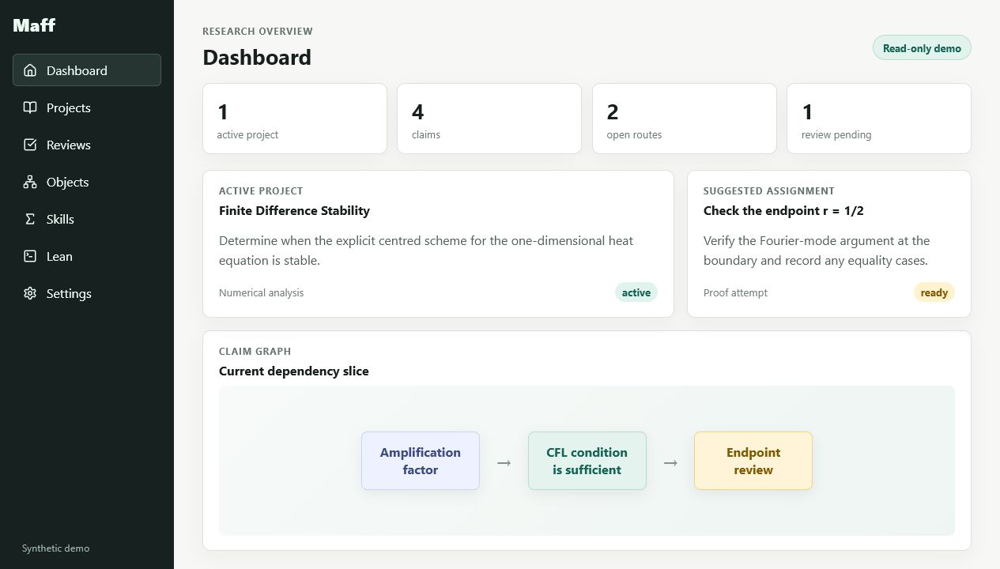

# Maff

Maff is the self-hosted system I use for organising mathematics research. Notes
stay in an Obsidian-compatible Markdown vault; the rest of the stack adds a
typed claim graph, task and review queues, an MCP interface, Quartz publishing
and a separate Lean 4 worker.

> This is an early alpha, not a turnkey hosted app. Setup is still involved and
> it has not had an independent security review. Do not put a real research
> vault or production credentials into a public demo.



The example vault is synthetic. My own notes, database, Lean workspaces and
environment files are not part of the repository.

The research-integrity lifecycle is documented in
[`docs/architecture/research-integrity-continuity.md`](docs/architecture/research-integrity-continuity.md).
It uses provenance-locked reviews, mandatory continuation handoffs, staged
unverified imports, immutable graph audits, separate repair campaigns, and
explicit final publication packages.

## Services

- `api`: TypeScript REST and MCP server with provider-neutral OIDC JWT verification through issuer-derived JWKS.
- `web`: React/Vite authenticated workbench for workspaces, nodes, graph, tasks, skills, and Lean jobs.
- `db`: PostgreSQL index/cache and permission store.
- `lean-worker`: internal Lean 4 worker with persistent Elan, cache, Lake, and workspace volumes.
- `quartz`: self-hosted Quartz renderer for workspace vaults.
- `caddy`: reverse proxy for `/app`, `/api`, `/mcp`, and `/sites`.

Markdown files remain the source of truth. The database stores users, permissions, indexes, jobs, and audit logs.

## Graph Model

The graph is about the mathematics rather than the project-management work.
Its main node types are `Problem`, `Claim`, `Definition`, `Paper`/`KnownResult`,
and substantial `Experiment` or `Draft` notes.

A `Claim` represents theorem-like mathematical content: conjectures, theorems, lemmas, propositions, corollaries, reductions, counterexample claims, and technical statements. Claim notes include sections for statement, status, role in project, dependencies, proof routes, informal proof, Lean formalization, attempts and notes, tasks, and decision log.

Proof routes, attempts, small gaps, Lean status and routine notes normally stay
inside the relevant Claim. They only become separate graph nodes when there is
a useful reason to treat them independently.

Tasks live in PostgreSQL and can point back to a node or section. They appear in
the work queues, not in the default mathematical graph.

Graph views are problem-scoped by default. A workspace can contain many Problems, and each Problem is the root of its own claim graph. Use `GET /api/workspaces/:workspaceId/problems` for the workspace overview and `GET /api/workspaces/:workspaceId/problems/:problemId/graph` for the default Problem -> Claim dependency graph. The MCP equivalents are `list_problem_graphs` and `get_problem_graph`.

The claim-centric model replaced an earlier star-shaped Conjecture/ProofRoute/Gap/Task design. Migration helpers remain for existing private workspaces, while new work should use Claim nodes.

## Local Dev

```bash
cp .env.example .env
# fill OIDC and Postgres values
docker compose up --build
```

Local ports are bound to localhost:

- Web: `http://127.0.0.1:3000`
- API: `http://127.0.0.1:3001`
- Lean worker: `http://127.0.0.1:8765`
- Postgres: `127.0.0.1:5432`

To preview the synthetic, read-only portfolio view without OIDC or an API:

```powershell
cd apps/web
$env:VITE_DEMO_MODE = "true"
npm run dev -- --host 127.0.0.1
```

Demo mode is selected at build time and exposes no authenticated application data or write paths.

For local OIDC development, register the exact callback and logout URL selected in `.env`; do not use wildcard production callbacks.

## VPS With Repo-Managed Caddy

```bash
git clone <private-repo-url> maff
cd maff
cp .env.example .env
# fill OIDC variables and POSTGRES_PASSWORD
docker compose --profile proxy up -d --build
```

Set `PUBLIC_BASE_URL_HOSTNAME=research.example.com` in `.env`. The bundled Caddyfile preserves `/api`, `/mcp`, `/.well-known/oauth-protected-resource`, and `/sites` prefixes when proxying to the API.

## VPS With Existing Caddy/Nginx

If your VPS already runs Caddy, nginx, Traefik, or another proxy, do not start the repo-managed Caddy service:

```bash
docker compose up -d --build db api web lean-worker
```

Configure the external proxy with prefix-preserving routes:

| Route | Upstream | Prefix behavior |
| --- | --- | --- |
| `/api/*` | `127.0.0.1:3001` | Preserve `/api` |
| `/mcp` | `127.0.0.1:3001` | Preserve `/mcp` |
| `/.well-known/oauth-protected-resource*` | `127.0.0.1:3001` | Preserve full path |
| `/sites/*` | `127.0.0.1:3001` | Preserve `/sites` |
| `/` or `/app/*` | `127.0.0.1:3000` | Serve the web app |

Do not use `handle_path /api*`, `rewrite`, or equivalent prefix stripping unless the Express routes are changed to match.

## OIDC / Keycloak Setup Checklist

1. Use the existing `bridges` realm. Production `OIDC_ISSUER` is exactly `https://auth.lachlanbridges.com/realms/bridges` (no trailing slash).
2. Use a public `maff-web` SPA client with Authorization Code flow, PKCE required with S256, and exact callback/logout URLs. It has no client secret.
3. Use a `maff` role container/resource client for Maff-only roles and set `OIDC_ROLE_CLIENT_ID=maff`. Roles are `reader`, `contributor`, `reviewer`, and `service-admin`.
4. Set `OIDC_AUDIENCE` exactly to `https://maff.lachlanbridges.com/mcp`; configure an audience mapper on token-producing clients.
5. Add OAuth client scopes `maff:read`, `maff:write`, `maff:review`, and `maff:admin`. The SPA requests exactly `openid profile email maff:read maff:write maff:review`; it does not request `offline_access` because normal interactive session renewal does not require a long-lived offline token.
6. Predefine `maff-chatgpt` as a public client with client authentication off, token endpoint authentication method `none`, Authorization Code flow on, PKCE S256 required, the exact ChatGPT callback, and the Maff MCP audience. Maff does not implement DCR.
7. Grant both the delegated scope and the matching `maff` client role. Unrelated client roles and realm roles are ignored. Workspace membership/role is checked independently.
8. Confirm `/api/auth/debug-token` shows the expected `aud`, `iss`, granted scopes, and internal user id without copying tokens into logs or tickets.

OIDC subjects are stored as exact `(issuer, subject)` identities attached to stable internal users. Historical `auth0Sub` values remain intact for rollback, but Auth0 tokens are not accepted after the issuer cutover. Email is never an automatic account-link key.

For the approved existing user, obtain the Keycloak subject through an authenticated administrative process, verify the approved internal user independently, take a database backup, and run `npm run admin:link-oidc-identity:src -- --user-id <internal uuid> --approved-by-user-id <administrator uuid> --issuer https://auth.lachlanbridges.com/realms/bridges --subject <keycloak subject>`. The transaction rejects conflicting identities and writes an audit record. Do not paste production identifiers into source, PRs, logs, or support threads. Perform the explicit link before that user signs in through Keycloak, because an unlinked first login creates a distinct internal user rather than merging by email.

The API derives the Keycloak JWKS URL only from the configured issuer, verifies RS256 signatures, issuer, audience, expiry and not-before locally, and does not use `/userinfo` or decoded-but-unverified claims for authorization.

Maff only acts as an MCP protected resource. It does not implement dynamic client registration, OAuth registration, authorization, or token endpoints; Keycloak handles those pieces. The old Auth0 DCR dependency is removed by using the predefined `maff-chatgpt` client.

Later users always receive their own private workspace. Shared workspace membership is explicit by default; set `AUTO_JOIN_SHARED_WORKSPACE=true` only if you want new users to be added automatically as viewers.

## MCP

Remote MCP endpoint:

```text
POST /mcp
```

Protected resource metadata:

```text
GET /.well-known/oauth-protected-resource
GET /.well-known/oauth-protected-resource/mcp
```

Both endpoints publish `resource: OIDC_AUDIENCE`, `authorization_servers: [OIDC_ISSUER]`, supported scopes (`maff:read`, `maff:write`, `maff:review`, `maff:admin`), and `resource_documentation: PUBLIC_BASE_URL`.

MCP exposes structured research tools such as `maff_bootstrap`, `create_claim`, `add_route_to_claim`, `log_proof_attempt`, `create_task`, `get_skill_pack`, `rebuild_quartz_site`, and Lean formalization tools. It intentionally does not expose arbitrary file writes, shell execution, or deletion tools.

Maff is tool-first and resource-supported. ChatGPT should normally call `maff_bootstrap` first whenever the user wants to create, save, resume, or work on anything in Maff. `maff_bootstrap` returns the selected workflow prompt, compact skills, graph context, queue decision, suggested tools, writeback plan, and user-facing response contract inline. MCP resources such as `workspace://...`, `node://...`, `graph://...`, `skill://...`, and `prompt://...` are stable read-only references for browsing and linking; do not rely on clients automatically fetching them for orchestration.

Prompt tools are also available:

- `list_prompts`
- `get_prompt`

The prompt catalog includes capture, triage, route generation, proof attack, gap analysis, literature, experiment, paper, weekly digest, and Lean formalization workflows.

Task queue policy: use queued tasks only when resuming an existing problem with no specific user idea and no explicit workflow. Claimed tasks use leases: normal workflows default to 20 minutes, Lean/formalization workflows default to 60 minutes. The graph is the durable memory, so long sessions should checkpoint by appending attempts/gaps/routes to Claim notes, creating attached tasks, and completing workflows.

Compatibility aliases remain available: `create_conjecture` creates a `Claim` with `claim_kind=conjecture`; `create_theorem_candidate` creates a theorem Claim; `create_lemma_candidate` creates a lemma Claim. Legacy route/gap/attempt tools append to Claim sections by default instead of creating graph nodes.

## Vaults

Workspace vaults live under:

```text
/data/workspaces/{workspaceSlug}/vault
```

Each node is one Markdown file with YAML frontmatter and Obsidian-style `[[wikilinks]]`.

## Lean

Lean workspaces live under:

```text
/data/lean-workspaces/{workspaceSlug}
```

The worker supports project creation, theorem stub creation, and `lake env lean path/to/file.lean` checks. Goal extraction and tactic search are MVP stubs.

Lean checks report `hasSorry` and `hasAxiom` by reading the source file directly. Maff will conservatively mark a theorem `lean_checked`, not `lean_verified`, when the latest check is missing, failed, or contains `sorry`/`axiom`.

## Smoke Checks

```bash
cd apps/api
npm run typecheck
npm run test:smoke
```

The smoke script verifies path traversal rejection, YAML frontmatter round-tripping, wikilink and typed-edge parsing, OIDC rejection behavior, authorization intersections, and the 89-tool MCP registry snapshot. Full migration validation still requires disposable Docker/Postgres.

## Caveats

- Markdown files are authoritative. PostgreSQL holds indexes, queues,
  permissions and audit records.
- The included workspace is synthetic.
- Auth and workspace roles are implemented, but deployment security is still
  the operator's responsibility.
- Lean runs away from the API, but a real deployment should still set container
  and host resource limits.
- Agent-produced mathematics is not assumed to be correct. It still needs
  review and, where appropriate, a Lean check.

See [SECURITY.md](SECURITY.md) and [CONTRIBUTING.md](CONTRIBUTING.md). Maff is licensed under the [MIT License](LICENSE).

## Future Work

Planned extensions include Git-backed vault mutations, semantic search, citation import, Loogle/LeanSearch integration, Lean LSP goals, websocket job updates, and LaTeX paper export.
