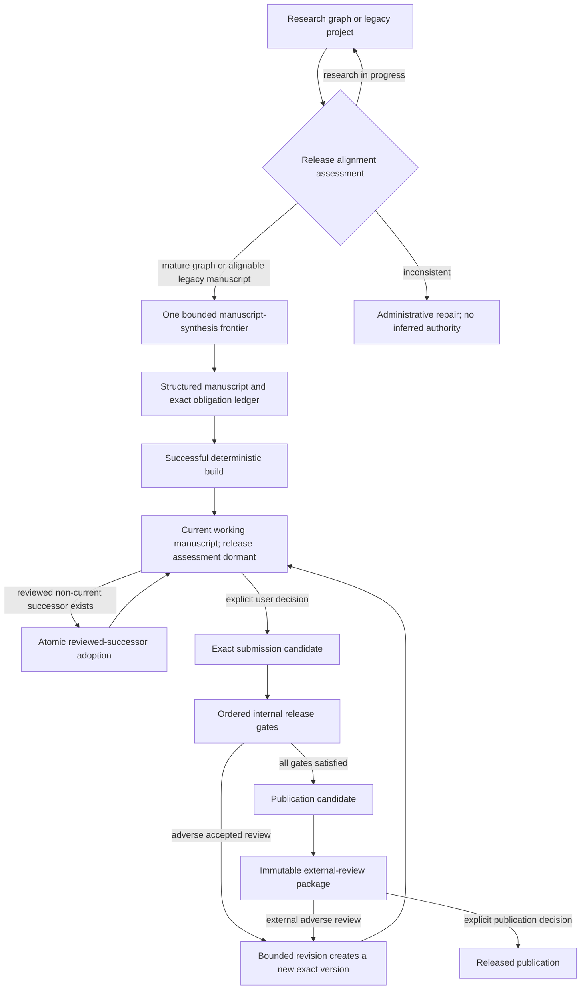

# Maff Manuscript Lifecycle and Release System

## 1. Purpose and scope

This document is the normative system description for taking a Maff project from a mature research graph to an independently reviewable manuscript and, eventually, a published release. It covers:

- alignment of pre-existing and legacy projects;
- structured manuscript synthesis and deterministic builds;
- exact-version proof obligations and non-transitive review evidence;
- current-working-manuscript authority;
- reviewed-successor adoption;
- deliberate submission-candidate activation;
- ordered internal release gates;
- third-party review packaging, external-review import, and publication;
- the LLM-facing release contract;
- transactional enforcement, idempotence, concurrency, failure handling, and testing.

The central design rule is separation of authority. A fact about which text is current is not a mathematical approval. A successful build is not a review. A review is not inherited by a changed manuscript. A review package is not publication. Publication is not inferred from readiness.

The keywords **MUST**, **MUST NOT**, **SHOULD**, and **MAY** below describe system invariants and supported client behavior.

## 2. The five independent dimensions of manuscript state

Many historical failures came from treating several independent questions as one vague notion of “canonical” or “finished.” Maff instead models five dimensions.

| Dimension | Question answered | Authoritative representation | What it does not mean |
| --- | --- | --- | --- |
| Working-text authority | Which exact manuscript is the project currently editing and discussing? | `Project.currentWorkingPaperId` plus exactly one matching `ManuscriptVersion.isCanonical=true` | Reviewed, correct, frozen, submission-ready, or published |
| Mathematical/evidence state | What exact claims, obligations, checks, and reviews exist for this version? | `ProofObligation`, `ReviewRound`, `ReviewObligationCheck`, exact targets and fingerprints | Current working text or publication |
| Lifecycle state | Is this ordinary development, final candidate assessment, or a released version? | `ManuscriptVersion.lifecycleStage` | Mathematical truth or approval by itself |
| Physical-artifact state | Do managed source and PDF bytes exist and match the exact version? | `PaperBuild`, `Artifact`, `ArtifactManuscriptVersion`, hashes and manifests | Mathematical review or publication |
| Publication state | Has an exact prepared package been explicitly released? | `PublicationPackage`, project status, release timestamps | Merely being ready or externally reviewable |

`ManuscriptVersion.isCanonical` is retained as a storage field, but its only supported meaning is **current working text**. LLM-facing responses state this as `canonical_semantics=current_working_text_only`.

## 3. Core durable objects

### 3.1 `ManuscriptVersion`

A manuscript version is immutable in identity and content meaning. It records:

- a monotonically increasing project-local version number;
- a content hash;
- theorem and citation fingerprints;
- working-authority, verification, freeze, and lifecycle fields;
- its underlying research artifact;
- exact-version obligations, builds, review assignments, physical artifacts, and packages.

A changed substantive manuscript MUST become a new version. Historical versions and reviews MUST remain intact.

### 3.2 `ProofObligation`

An obligation is an atomic mathematical interface between graph evidence and manuscript exposition. A useful required obligation records a statement and at least one meaningful assumption, boundary case, or excluded regime. It may also record dependencies, source locations, manuscript locations, external theorems, semantic consequences, and whether exact manuscript proof text is present.

Proof obligations MUST describe mathematics. They MUST NOT be invented for canonicality, lifecycle flags, policy interpretation, approval labels, or other governance facts.

### 3.3 `PaperBuild` and physical `Artifact`

A successful build binds:

- one exact `ManuscriptVersion`;
- its exact content hash in the build manifest;
- a builder version and source hash;
- managed source-bundle and compiled-PDF artifacts;
- durable storage keys, byte counts, and SHA-256 hashes.

A path, filename, URI, or hash without managed available bytes is not physical evidence.

### 3.4 `ReviewRound` and `ReviewAssignment`

A review is scoped evidence. It records its review type, exact target version, verdict, scope, checked references, inspected artifacts, checked obligations, independence, and the server-issued locked assignment from which it arose.

For an internal review to count as assigned evidence, its assignment MUST be submitted and its reviewer run MUST be submitted or completed. Required independence varies by gate. Old approvals are evidence only; they never automatically approve descendants.

### 3.5 `ResearchLink`

Research links preserve lineage and relevance. Important manuscript relations include:

- `derived_from` to source or predecessor artifacts;
- `source_successor_of` and `editorial_successor_of` between versions;
- `adopted_working_successor_of` for an atomic authority transition;
- contribution-claim and proof-obligation links.

Lineage is evidence of ancestry, not inherited approval.

## 4. Authoritative state machine

Only named semantic operations may move between these states. Lower-level field edits are implementation mechanisms, not supported agent workflows.

## 5. Alignment of existing projects

`assess_project_release_alignment` performs a read-only preflight and returns one of five classes:

1. natively aligned;
2. mature proof graph ready for manuscript synthesis;
3. legacy manuscript suitable for alignment;
4. research still in progress;
5. inconsistent state requiring administrative repair.

`align_project_release_state` is the sole supported mutation for alignable pre-existing projects. It is idempotent and creates or reuses exactly one bounded PaperWriter synthesis frontier. It MUST NOT create approval, candidacy, audit evidence, publication state, or inferred mathematical facts.

An inconsistent project is fail-closed. Maff MUST NOT guess which version should be current.

## 6. Structured synthesis and build

PaperWriter converts the mature graph into a structured manuscript whose sections retain stable keys and linked claims. The manuscript contains an explicit exact-version obligation ledger.

PaperBuilder deterministically materializes the structure into source and PDF artifacts. A successful ordinary build may make the built version the current working text, because that is an authoring operation. This working-authority change does not mean the manuscript has passed any release gate.

Ordinary manuscript development continues while `release_assessment_active=false`. Final proof-integration, novelty, bibliography, end-to-end, editorial, and publication-readiness work MUST NOT be manufactured merely because a draft exists.

## 7. Reviewed-successor adoption

### 7.1 Why this is a separate transition

A reviewed successor may exist as a complete, cleanly built non-current version. Making it current is neither manuscript creation nor submission-candidate activation. Combining those meanings would silently change mathematical or release state.

The supported operation is `adopt_reviewed_manuscript_successor`.

### 7.2 Required identifiers

The caller supplies all of:

- workspace and project;
- expected current manuscript version;
- successor manuscript version;
- supporting exact approval `ReviewRound`;
- exact clean `PaperBuild`.

These identifiers are optimistic-concurrency inputs, not suggestions.

### 7.3 Preconditions

Before adoption, the server verifies:

1. The project exists in the workspace.
2. The project pointer and sole canonical flag identify the expected current version.
3. No contradictory additional canonical version exists.
4. The successor is a distinct later version in the same project and workspace.
5. The successor is not already canonical, unless this is an idempotent replay of the same completed adoption.
6. The successor has a non-empty required obligation ledger.
7. Explicit lineage connects the successor to the expected current version or its research artifact.
8. The supplied build succeeded for the exact successor.
9. The build manifest names the exact successor ID and content hash.
10. Both source and PDF artifacts are available managed bytes with storage keys, sizes, and hashes.
11. The review targets the exact successor through `targetVersion`.
12. The review verdict is approved and its evidence status is assigned-valid.
13. The review comes from a submitted locked assignment and a completed/submitted reviewer run.
14. Reviewer independence is `independent_reviewer` or `external_referee_style`.
15. Review scope names the exact supplied build.
16. Checked references explicitly include the exact successor and build.
17. Inspected artifact IDs include that build's exact source and PDF.
18. Checked obligation IDs cover every required successor obligation.

The review's surrounding workflow object may be a Gap or another bounded remediation object. Exactness comes from `targetVersion`, build scope, inspected artifacts, and checked obligations—not from assuming every valid review workstream directly targets a manuscript.

### 7.4 Atomic effects

The operation runs in a serializable database transaction. It:

1. re-reads and validates every precondition;
2. marks the expected predecessor non-current and records `supersededAt`;
3. marks the successor as the sole current working version;
4. moves `Project.currentWorkingPaperId` to the successor;
5. creates exactly one `adopted_working_successor_of` provenance link recording the review and build.

It MUST NOT:

- rebuild or rewrite either manuscript;
- create a duplicate manuscript or review;
- change proof obligations or mathematical objects;
- change verification state or freeze level;
- change lifecycle stage;
- activate release assessment;
- create an external-review package;
- publish or complete the project.

### 7.5 Idempotence and concurrency

Repeating the same operation after success returns the already adopted result if the expected adoption provenance exists. It does not create another link or mutate state again.

If another operation changes the current pointer or canonical set first, the expected-current precondition fails. Serializable isolation prevents two conflicting authority transitions from both being accepted as though they observed the same state.

### 7.6 Contract behavior

While an eligible reviewed successor is pending, the release contract exposes only `adopt_reviewed_manuscript_successor`. After adoption, readiness is recomputed. If ordinary development remains active, the contract may then expose `promote_manuscript_to_submission_candidate` with the adopted successor as its exact target.

## 8. Deliberate submission-candidate activation

Candidate activation is a distinct user decision. `promote_manuscript_to_submission_candidate`:

- selects the exact candidate;
- ensures it is current;
- chooses or infers a bounded load-bearing obligation set;
- changes lifecycle stage to `submission_candidate`;
- retires stale active work tied to predecessor candidates;
- recomputes readiness.

It does not itself satisfy final review gates. Candidate activation merely turns those gates on for one exact immutable target.

The release contract marks this action `requires_user_decision=true`. An LLM MUST NOT interpret “the build passed,” “the review approved a repair,” or “the manuscript is basically finished” as that decision.

## 9. Readiness and non-transitive review gates

`compute_submission_readiness` is the single authoritative release evaluator. The LLM contract is derived from its result and is not a competing policy engine.

The ordered core gate plan is:

1. compile and exact physical-artifact integrity;
2. proof integration;
3. novelty;
4. bibliography;
5. end-to-end mathematics;
6. editorial suitability.

Additional blockers include adverse exact reviews, weak or empty obligation ledgers, required numerical validation, unresolved external challenges, and relevant open major/critical/fatal gaps.

### 9.1 Exactness and permitted reuse

- Compile evidence is exact-version only.
- Proof-integration evidence is exact-version only, except for explicitly verified editorial-only lineage.
- End-to-end mathematical evidence is exact-version only, except for explicitly verified editorial-only lineage.
- Novelty evidence may carry only when the theorem fingerprint is unchanged.
- Bibliography evidence may carry only when the citation fingerprint is unchanged.
- Generic reports and legacy-unspecified reviews do not substitute for typed release gates.

### 9.2 Proof-integration completeness

Every required obligation must be preserved. Load-bearing obligations additionally require journal-verifiable exposition evidence covering, where applicable:

- intermediate arguments;
- uniformity or domination;
- endpoints and exceptional cases;
- normalizers and denominators;
- notation and quantifiers;
- applicability of external theorems.

### 9.3 Relevant gaps

Readiness traverses selected research links from the exact manuscript, its source artifacts, obligations, and governing claims. A relevant open major, critical, or fatal gap blocks release and is returned with an object path. An unrelated branch gap does not block the manuscript merely because it exists in the project.

### 9.4 Circuit breaker

If accepted evidence does not cause the expected gate transition, or repeated exact reviews add no new issues while the gate remains unsatisfied, readiness activates a workflow circuit breaker. The contract then exposes no mutation tool. Clients MUST stop duplicate review work and surface the evidence inconsistency.

## 10. External review and publication

When every internal gate is satisfied, the manuscript becomes a publication candidate. This still does not publish anything.

`prepare_external_review_package` creates or returns an idempotent immutable package containing the exact source and PDF. It leaves the project active and provides the authoritative third-party handoff.

External feedback is imported immutably against an exact version/package. Adverse feedback creates a bounded revision frontier and therefore a new exact manuscript version; it does not rewrite historical approval.

`publish_manuscript` is a separate explicit user decision. It releases the already prepared exact package, marks publication state, and remains idempotent. Packaging cannot silently publish, and publication cannot silently manufacture a missing review package.

## 11. The LLM-facing release contract

`get_project_release_contract` returns a versioned machine contract containing:

- policy and schema versions;
- current working and active candidate IDs;
- pending reviewed-successor evidence IDs, when applicable;
- invariant truths;
- classified blockers;
- exactly one next action;
- zero or one permitted mutation tool;
- prohibited shortcuts;
- an enforcement instruction.

The client algorithm is:

1. Read the contract immediately before any release mutation.
2. Treat `authoritative_ids` as exact, not advisory.
3. If `permitted_mutation_tools` contains one tool, use only that tool with the exact supplied target and evidence IDs.
4. If the action requires a user decision, wait for that decision.
5. If the list is empty, stop and surface the blocker or system inconsistency.
6. After any successful transition, discard the old contract and fetch a new one.

An LLM MUST NOT compose lower-level canonical, pointer, lifecycle, freeze, verification, artifact, report, audit, gap, or review mutations to emulate a semantic transition.

When the contract selects `claim_next_review` during active release assessment, the backend routes only the named gate against `next_action.exact_target_id`. Preserved historical or generic submitted reports remain queued for ordinary review but cannot pre-empt the active exact-candidate gate. The selected assignment is checked again against the contract immediately before its locked review assignment is created.

## 12. Enforcement layers and residual trust boundary

The system has three enforcement layers:

1. **Durable-data constraints and transactions.** These enforce object ownership, exact references, atomic successor adoption, provenance, idempotence, and conflict detection.
2. **Readiness and semantic operation preconditions.** These decide whether evidence counts and reject malformed or insufficient transitions.
3. **The LLM contract and role prompts.** These make the state machine explicit and prevent a model from plausibly claiming it misunderstood “canonical,” approval, candidacy, or publication.

The contract currently governs which release mutation a compliant MCP client should call. Exact release-review routing and reviewed-successor adoption enforce their contract target transactionally, but the generic MCP dispatcher does not yet centrally compare every other incoming release mutation name against the latest contract before dispatch. Individual semantic operations still validate their own substantive preconditions; however, omission from `permitted_mutation_tools` is not itself a universal dispatcher-level authorization denial.

Therefore the strongest future hardening is a central release-mutation guard that, in the same request path, recomputes the contract and rejects any release mutation not currently listed, with a narrowly defined exception for explicit administrative repair. Until that is implemented, contract compliance remains part of the client trust boundary even though the high-risk adoption operation itself is transactionally guarded.

## 13. Failure taxonomy

| Failure class | Required behavior |
| --- | --- |
| Missing ordinary work | Return the next assignment frontier; do not create governance work |
| Explicit user decision pending | Expose the exact decision and wait |
| Missing exact evidence | Name the gate and target; do not accept generic substitutes |
| Reviewed successor pending | Expose only atomic successor adoption |
| External condition pending | Wait for or import the exact external evidence |
| Contradictory canonical/pointer state | Stop for administrative repair; do not infer authority |
| Accepted evidence not moving a gate | Activate circuit breaker; do not repeat review |
| Tool/connector timeout with unknown commit status | Re-read authoritative state before retrying any idempotent operation |
| Service restart during a call | Treat response absence as unknown; verify state, then replay only an idempotent exact operation |
| Build infrastructure pressure | Preserve the healthy running service, stop competing builds, and test/deploy from a controlled build environment |

## 14. Incident lessons from the reviewed-successor gap

The earlier refactor implemented alignment and candidate activation but omitted the intermediate transition from reviewed non-current successor to current working manuscript. The release contract consequently continued to target the stale current version. A compliant LLM stopped rather than forcing a pointer change, which was safer than mutation but left the project blocked.

The defect was a state-machine coverage failure:

- the domain had a real state with no named transition;
- the contract was fail-closed but could only report the stale target;
- tests covered graph-to-manuscript and manuscript-to-candidate, but not reviewed-successor-to-working-manuscript;
- operational connector disappearance obscured the semantic defect but did not cause it.

The repair added the missing transition, production-shaped discovery, explicit LLM invariants, and a database regression whose review workflow target is a Gap while its exact evidence targets the manuscript/build/artifacts/obligations. This prevents tests from assuming an unrealistically tidy workflow shape.

## 15. Verification strategy

The minimum verification pyramid is:

### 15.1 Source contract tests

Assert stable tool count, schemas, annotations, blocker classes, prohibited shortcuts, exact next actions, and zero-or-one permitted mutation behavior.

### 15.2 Database semantic regressions

Use disposable migrated PostgreSQL databases to prove transactions, relationships, idempotence, historical retention, exact evidence binding, and unchanged fields.

### 15.3 Golden lifecycle replay

The MMRW replay reconstructs the known-good path from mature proof graph through alignment, synthesis, deterministic build, candidacy, every internal gate, external-review packaging, imported third-party review, explicit publication, and terminal idempotence.

### 15.4 Production-shaped successor regression

The successor fixture proves:

- the pending contract exposes adoption only;
- exact current, successor, review, build, artifacts, and obligations are validated;
- a Gap-targeted remediation review can still be exact manuscript evidence;
- predecessor history is preserved;
- successor verification, freeze, lifecycle, and obligations do not change;
- repeated adoption is idempotent;
- the recomputed contract targets the successor for candidate activation.

### 15.5 Deployment verification

Before production mutation:

1. verify the deployed commit and MCP version;
2. verify the expected tool count and operation presence;
3. run the complete lifecycle suite on a disposable database;
4. read the production release contract;
5. execute only its exact permitted mutation;
6. compare before/after state and re-read the contract;
7. verify public service health.

Large production images SHOULD be built in CI or another adequately resourced builder and deployed as immutable images. Building the TeX-heavy image directly on a 1 GB VPS risks swap saturation and transient unavailability.

## 16. All-project acceptance criteria

A project is correctly aligned with this system only when all applicable criteria are machine-observable:

1. Alignment classification is explicit and does not depend on model inference.
2. At most one current working manuscript exists, and its canonical flag agrees with the project pointer.
3. Every working manuscript has a non-empty meaningful exact-version obligation ledger and constructive provenance.
4. Manuscript versions are immutable historical identities rather than overwritten documents.
5. Review evidence is typed, assigned, exact-targeted or explicitly fingerprint-reusable, and independently produced where required.
6. Reviews do not transitively approve descendants.
7. Managed source/PDF bytes and exact build manifests back physical claims.
8. Reviewed-successor adoption is separate from candidate activation.
9. Candidate activation is an explicit user decision against one exact current version.
10. Readiness is centralized and returns one ordered next action.
11. The LLM contract exposes no more than one permitted mutation tool.
12. Circuit-broken or inconsistent states expose no model-facing workaround.
13. External-review packaging, external-review import, and publication are distinct transitions.
14. Every semantic transition is idempotent or guarded against stale expected state.
15. Tests cover both ideal golden paths and production-shaped historical failure classes.
16. Deployment verification uses the actual running revision and a disposable database before production mutation.

## 17. Operator checklist

For any manuscript project approaching release:

1. Run alignment assessment.
2. Resolve only genuine inconsistent state administratively.
3. Synthesize through one bounded PaperWriter frontier.
4. Build with PaperBuilder and verify managed exact bytes.
5. Read the release contract.
6. Adopt a reviewed successor if and only if the contract names it.
7. Re-read the contract.
8. Obtain the user's deliberate candidate-activation decision.
9. Complete only the ordered exact gate.
10. Stop on circuit breakers rather than repeating review.
11. Prepare the external-review package without publishing.
12. Import third-party feedback against the exact package.
13. Publish only on explicit instruction.
14. Verify terminal state and retain all historical provenance.

This checklist is a convenience. The database state, semantic transitions, readiness computation, and current release contract remain authoritative.
